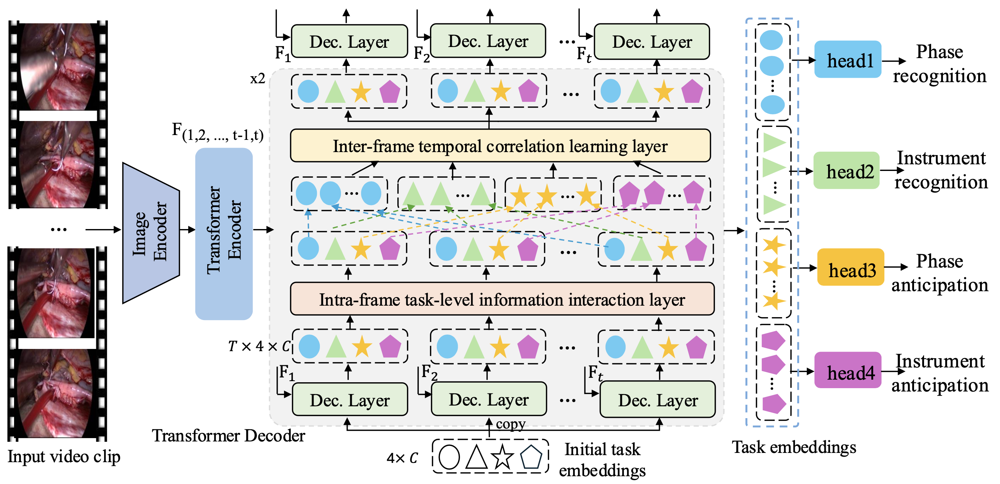
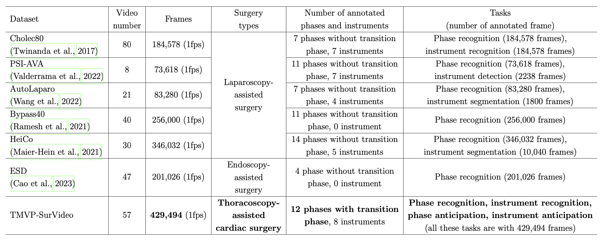
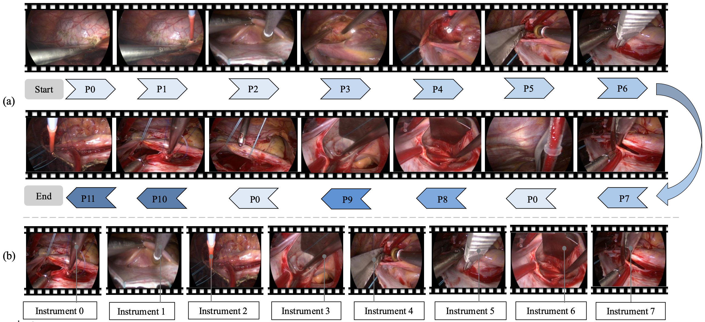

# A New Dataset and Versatile Multi-Task Surgical Workflow Analysis Framework for Thoracoscopic Mitral Valvuloplasty

By Meng Lan, Xinjian Yan,  Weixin Si, Xiaomeng Li.

## Introduction
* The official implementation for our paper "A New Dataset and Versatile Multi-Task Surgical Workflow Analysis Framework for Thoracoscopic Mitral Valvuloplasty".

<center>

</center>


**Abstract.** Surgical Workflow Analysis (SWA) on videos is critical for AI-assisted intelligent surgery. Existing SWA methods primarily focus on laparoscopic surgeries, while research on complex thoracoscopy-assisted cardiac surgery remains largely unexplored. In this paper, we introduce **TMVP-SurVideo**, the first SWA video dataset for **Thoracoscopic cardiac Mitral ValvuloPlasty (TMVP)**. TMVP-SurVideo comprises 57 independent long-form surgical videos and over 429K annotated frames, covering four key tasks, namely phase and instrument recognitions, and phase and instrument anticipations. To achieve a comprehensive SWA system for TMVP and overcome the limitations of current SWA methods, we propose **SurgFormer**, the first query-based Transformer framework that simultaneously performs recognition and anticipation of surgical phases and instruments. SurgFormer uses four low-dimensional learnable task embeddings to independently decode representation embeddings for the predictions of the four tasks. During the decoding process, an information interaction module that contains the intra-frame task-level information interaction layer and the inter-frame temporal correlation learning layer is devised to operate on the task embeddings, enabling the information collaboration between tasks within each frame and temporal correlation learning of each task across frames. Besides, SurgFormer's unique architecture allows it to perform both offline and online inferences using a dynamic memory bank without model modification. Our proposed SurgFormer is evaluated on the TMVP-SurVideo and existing Cholec80 datasets to demonstrate its effectiveness on SWA


## TMVP-SurVideo Dataset
TMVP-SurVideo is the first large-scale surgical video dataset for TMVP, with frame-level annotations for four tasks: phase recognition, instrument recognition, phase anticipation and instrument anticipation.

<div align="center"> Comparson bwtween TMVP-SurVideo and existing SWA datasets </div>

<!--  -->
<center>

</center>

<div align="center">Overview of the phases and instruments in TMVP-SurVideo dataset.</div>

<center>

</center>
<!--  -->


## Installation

### Requirements
  
* Python>=3.7

    We recommend you to use miniconda to create a conda environment:
    ```bash
    conda create -n swa python=3.7 pip
    ```
    Then, activate the environment:
    ```bash
    conda activate swa
    ```
  
* PyTorch>=2.1.0, torchvision>=0.6.1 (following instructions [here](https://pytorch.org/))

    For example, if your CUDA version is 11.8, you could install pytorch and torchvision as following:
    ```bash
    conda install pytorch=2.1.0 torchvision=0.16.0 cudatoolkit=11.8 -c pytorch
    ```
  
### Compiling CUDA operators
```bash
cd ./models/ops
sh ./make.sh
# unit test (should see all checking is True)
python test.py
```

## Usage

### Dataset preparation

The whole TMVP-SurVideo dataset will be released at [here]()

Five test videos could be download at [here]()

* The structure of data folder is arranged as follows:
```
(root folder)
├── data
|  ├── TMVP-SurVideo
|  |  ├── frames
|  |  |  ├── 001
|  |  |  ├── 002
|  |  |  ├── 003
|  |  |  ├── ......
|  |  ├── phase_annotations
|  |  |  ├── 001.txt
|  |  |  ├── 002.txt
|  |  |  ├── ......
|  |  ├── instrument_annotations
|  |  |  ├── 001.txt
|  |  |  ├── 002.txt
|  |  |  ├── ......
|  |  ├── phase_anticipation_annotations
|  |  |  ├── 001.txt
|  |  |  ├── 002.txt
|  |  |  ├── ......
|  |  ├── instrument_anticipation_annotations
|  |  |  ├── 001.txt
|  |  |  ├── 002.txt
|  |  |  ├── ......
├── code
|  ├── ......
```

### Training
The model is trained in a distribued manner.

```bash
sh train.sh
```

### Inference

```bash
sh test.sh
```


<!-- ## Citing Deformable DETR
If you find Deformable DETR useful in your research, please consider citing:
```bibtex
@article{zhu2020deformable,
  title={Deformable DETR: Deformable Transformers for End-to-End Object Detection},
  author={Zhu, Xizhou and Su, Weijie and Lu, Lewei and Li, Bin and Wang, Xiaogang and Dai, Jifeng},
  journal={arXiv preprint arXiv:2010.04159},
  year={2020}
}
``` -->
